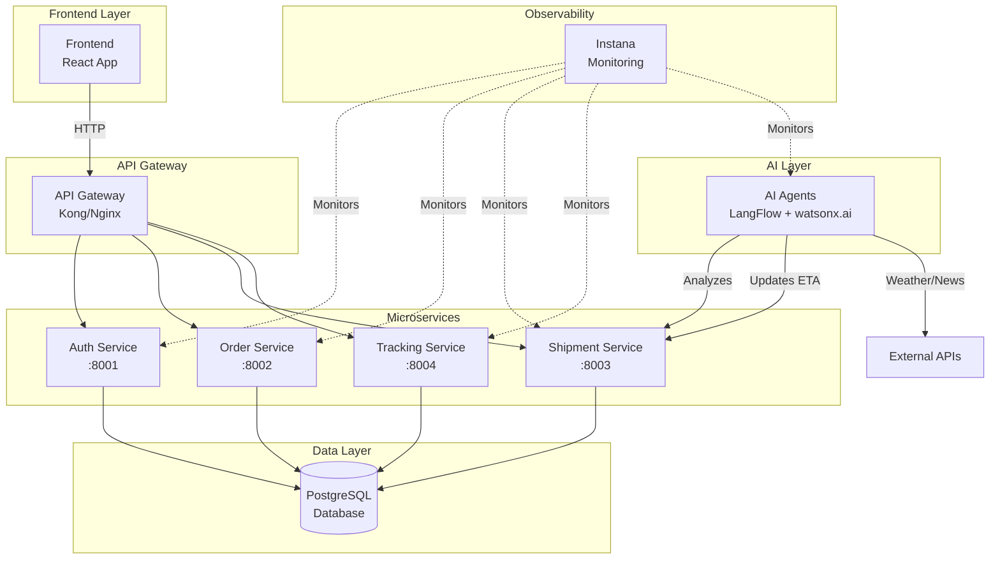

# Hands on lab for Agent Provision, Observability and Integration

A comprehensive, hands-onlab series for deploying and observing a microservices-based Logistics Application with AI agents on Kubernetes

This repository contains three progressive labs that guide you through:
- Provisioning AI agents using Terraform and Ansible
- Real-time observability and AI agent monitoring using Instana
- Integrating AI agents into enterprise systems using webMethods

---

## 📚 Lab Structure

### [Lab 0: Prerequisites and Environment Setup ](./Lab0-Prerequisites-Env-Setup/)
**Duration:** 10 minutes | **Level:** Advanced

Check the Prerequisites, do the required installation and Environment Setup.

---

### [Lab 1: Infrastructure Provisioning and Kubernetes-Based Application Deployment](./Lab1-Infrastructure-Deployment/)
**Duration:** 60 minutes | **Level:** Advanced

Provision cloud infrastructure, deploy K3s, and run the Logistics Application with AI agents.

**What You'll Learn:** Terraform-based infrastructure provisioning on IBM Cloud | K3s installation and configuration | Microservices deployment using Ansible | Instana agent setup for observability

**Key Technologies:** Terraform, Ansible, K3s, IBM Cloud, Instana

---

### [Lab 2: Agent and Application Observability Using Instana](./Lab2-Observability/)
**Duration:** 50 minutes | **Level:** Advanced

Explore real-time monitoring, analytics, and troubleshooting of microservices and AI agents.

**What You'll Learn:** Application Perspective creation in Instana | Service-to-service call flow analysis | AI agent behavior monitoring | Performance analytics and bottleneck identification

**Key Technologies:** Instana, Kubernetes, AI Observability

---

### [Lab 3: Agentic Integration with IBM webMethods Hybrid Integration](./Lab3-Enterprise-Integration/)
**Duration:** 60 minutes | **Level:** Advanced

Integrate AI agents with enterprise systems using webMethods workflows and APIs.

**What You'll Learn:** AI becomes truly effective only when integration aggregates, transforms, and contextualizes enterprise data. This lab focuses on integrating AI agents into enterprise systems using IBM webMethods Hybrid Integration. Participants will explore Integration workflows and API Gateway for seamless data exchange, transformation, system interoperability as well as security and governance.

**Key Technologies:** webMethods, REST APIs, AI Agents

---

## 🏗️ Application Architecture

The Logistics Application is a microservices-based system consisting of:



---

## 🚀 Getting Started

The detailed Prerequisites and environment setup would be discussed in the next lab.

As we are going to execute the lab using the Jupyter lab, lets verify and setup the below requirements.

#### Required Tools for now.
- [ ] Python 3.9 or above 
- [ ] Jupyter Notebook or JupyterLab
- [ ] Git

### 1. Python

1. Python 3.9 or above is required. Run the below command to ensure it is installed. If not installed install the same.

```
python --version
```

### 2. Download this Repo

1. Download this Github repository from the browser as a zip file and unzip in some working folder.

Or Clone the repository into some working folder.

   ```bash
   git clone <repository-url>
   cd <repository-root-folder>
   ```

2. In the command line window or in the Terminal window get into the root folder of the repository.

   ```bash
   cd <repository-root-folder>
   ```

### 3. Install Python dependencies

1. Create a virtual environment `venv` and activate it by using the below command

Linux/Mac:
```
python -m venv venv
source venv/bin/activate
```

Windows:
```
python -m venv venv
venv\\Scripts\\activate
```

2. Install the Python dependencies using the below command

   ```bash
   pip install -r requirements.txt
   ```

### 3. Open JupyterLab

The jupyterlab should have been installed as part of the above step. 

1. Open jupyterlab using the below command

```
jupyter lab 
```
 
JupyterLab will start and open in a new browser window at the URL http://localhost:8888/

---

**Ready to begin?** Start with [Lab 0: Lab0-Prerequisites-Env-Setup](./Lab0-Prerequisites-Env-Setup/)
