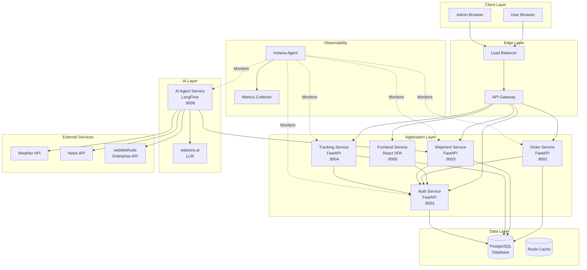
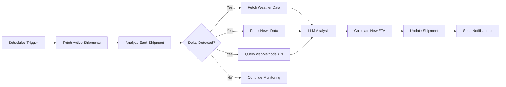
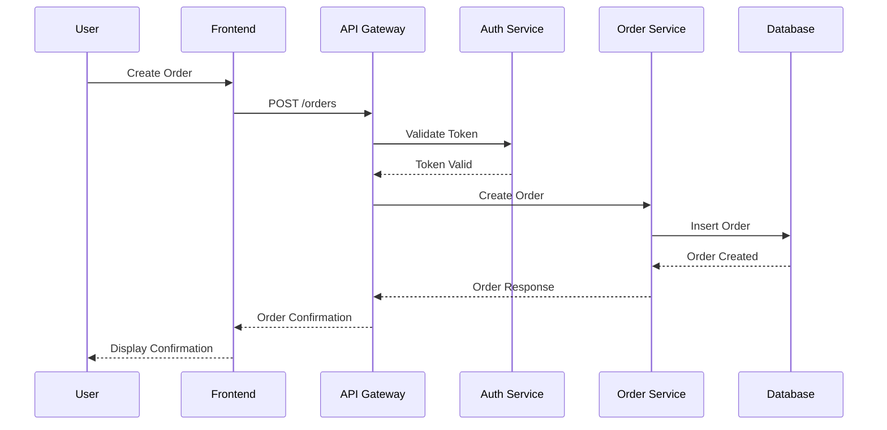
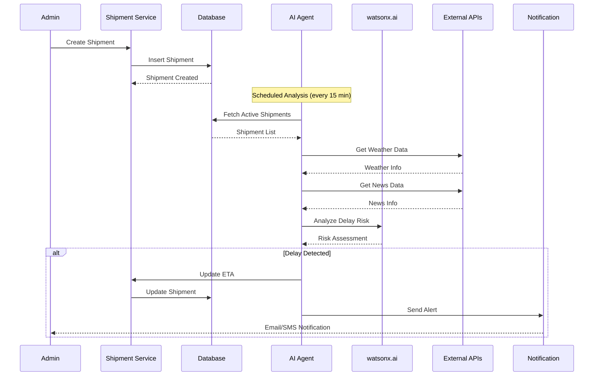
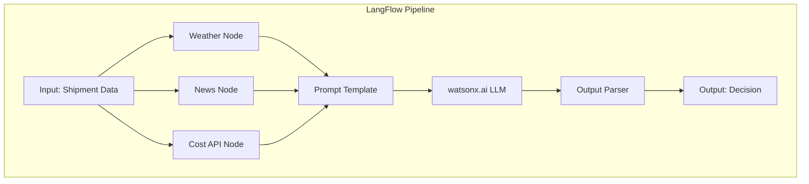
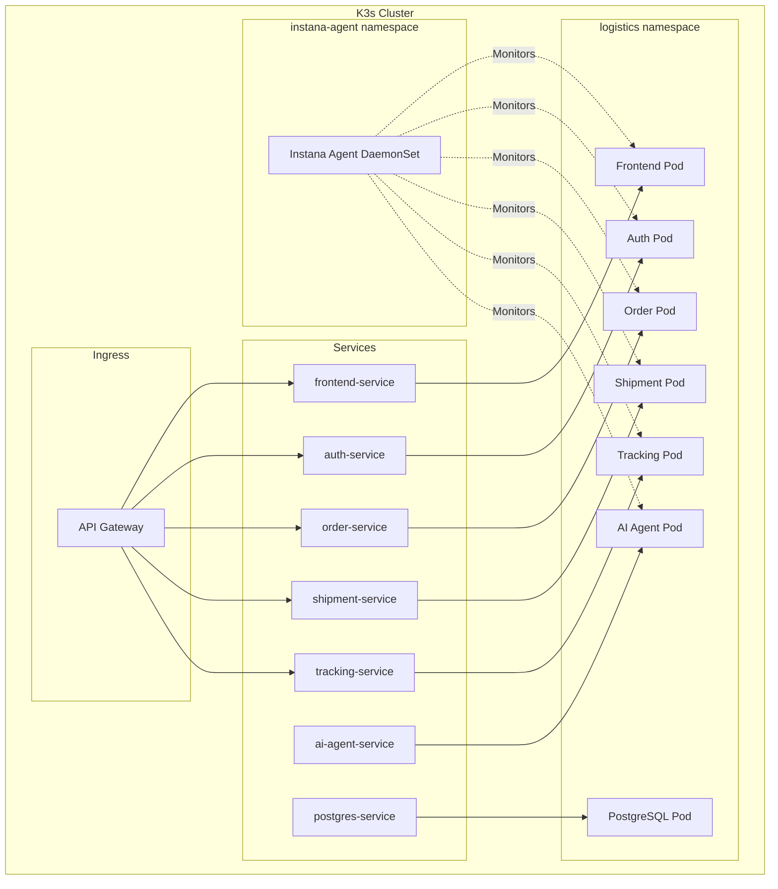
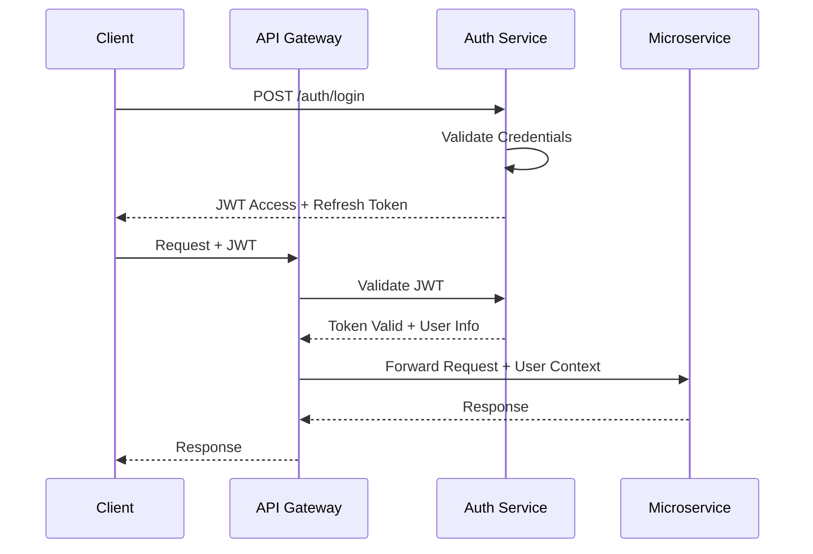
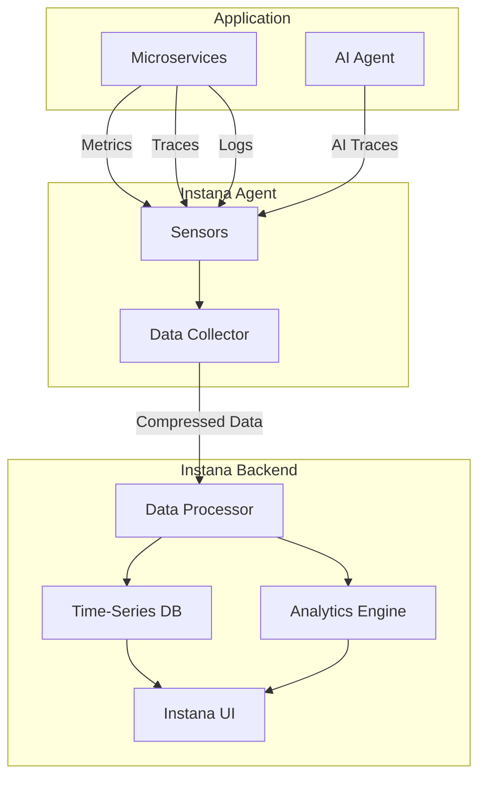

# Logistics Application Architecture

This document provides a comprehensive overview of the Logistics Application architecture, components, and data flows.

## Table of Contents

- [System Overview](#system-overview)
- [Component Architecture](#component-architecture)
- [Data Flow](#data-flow)
- [AI Agent Architecture](#ai-agent-architecture)
- [Infrastructure Architecture](#infrastructure-architecture)
- [Security Architecture](#security-architecture)
- [Observability Architecture](#observability-architecture)

---

## System Overview

The Logistics Application is a cloud-native, microservices-based system designed to manage logistics operations with AI-powered shipment tracking and ETA prediction.

### Key Characteristics

- **Architecture Pattern:** Microservices
- **Deployment:** Kubernetes (K3s)
- **Database:** PostgreSQL
- **AI Framework:** LangFlow + watsonx.ai
- **Observability:** Instana
- **API Gateway:** Kong/Nginx
- **Frontend:** React (SPA)
- **Backend:** FastAPI (Python)

---

## Component Architecture

### High-Level Architecture



---

## Component Details

### 1. Frontend Service

**Technology:** React, Vite, TypeScript  
**Port:** 8000  
**Container:** Nginx

**Responsibilities:**
- User interface for customers and admins
- Order creation and management
- Shipment tracking visualization
- Real-time ETA updates
- Authentication flow

**Key Features:**
- Responsive design
- Real-time updates via WebSocket
- Role-based UI (User/Admin)
- Dashboard with analytics

---

### 2. Authentication Service

**Technology:** FastAPI, Python 3.11  
**Port:** 8001  
**Database:** PostgreSQL

**Responsibilities:**
- User registration and login
- JWT token generation and validation
- Role-based access control (RBAC)
- Session management

**API Endpoints:**
```
POST   /auth/register      - User registration
POST   /auth/login         - User login
POST   /auth/refresh       - Token refresh
GET    /auth/me            - Get current user
POST   /auth/logout        - User logout
GET    /health             - Health check
```

**Security:**
- Password hashing (bcrypt)
- JWT with RS256 algorithm
- Token expiration (30 min access, 7 days refresh)
- Rate limiting

---

### 3. Order Service

**Technology:** FastAPI, Python 3.11  
**Port:** 8002  
**Database:** PostgreSQL

**Responsibilities:**
- Order creation and management
- Order status tracking
- Order history
- Customer order queries

**API Endpoints:**
```
POST   /orders             - Create order
GET    /orders             - List orders
GET    /orders/{id}        - Get order details
PUT    /orders/{id}        - Update order
DELETE /orders/{id}        - Cancel order
GET    /orders/user/{id}   - Get user orders
GET    /health             - Health check
```

**Data Model:**
```python
Order:
  - id: UUID
  - user_id: UUID
  - items: JSON
  - total_amount: Decimal
  - status: Enum (pending, confirmed, shipped, delivered)
  - created_at: DateTime
  - updated_at: DateTime
```

---

### 4. Shipment Service

**Technology:** FastAPI, Python 3.11  
**Port:** 8003  
**Database:** PostgreSQL

**Responsibilities:**
- Shipment creation and management
- ETA calculation and updates
- Shipment status tracking
- Integration with AI agents

**API Endpoints:**
```
POST   /shipments          - Create shipment
GET    /shipments          - List shipments
GET    /shipments/{id}     - Get shipment details
PUT    /shipments/{id}     - Update shipment
PUT    /shipments/{id}/eta - Update ETA
GET    /shipments/order/{id} - Get order shipments
GET    /health             - Health check
```

**Data Model:**
```python
Shipment:
  - id: UUID
  - order_id: UUID
  - tracking_number: String
  - origin: String
  - destination: String
  - initial_eta: DateTime
  - current_eta: DateTime
  - status: Enum (created, in_transit, delayed, delivered)
  - carrier: String
  - created_at: DateTime
  - updated_at: DateTime
```

---

### 5. Tracking Service

**Technology:** FastAPI, Python 3.11  
**Port:** 8004  
**Database:** PostgreSQL

**Responsibilities:**
- Real-time shipment tracking
- Location updates
- Event logging
- Notification triggers

**API Endpoints:**
```
POST   /tracking           - Add tracking event
GET    /tracking/{shipment_id} - Get tracking history
GET    /tracking/latest/{shipment_id} - Get latest location
GET    /health             - Health check
```

**Data Model:**
```python
TrackingEvent:
  - id: UUID
  - shipment_id: UUID
  - location: String
  - latitude: Float
  - longitude: Float
  - status: String
  - description: String
  - timestamp: DateTime
```

---

### 6. AI Agent Service

**Technology:** LangFlow, Python, watsonx.ai  
**Port:** 8006

**Responsibilities:**
- Analyze shipment data
- Detect potential delays
- Recalculate ETAs
- Generate notifications
- Integrate with external APIs

**AI Agent Workflow:**



**AI Capabilities:**
- Natural language processing for news analysis
- Weather impact assessment
- Route optimization suggestions
- Predictive delay detection
- Automated stakeholder communication

**Integration Points:**
- Weather API (OpenWeatherMap)
- News API (NewsAPI.org)
- webMethods (cost calculation)
- watsonx.ai (LLM reasoning)

---

## Data Flow

### Order Creation Flow



### Shipment Creation and AI Analysis Flow



---

## AI Agent Architecture

### LangFlow Integration



### AI Decision Logic

**Input Parameters:**
- Current shipment location
- Destination
- Original ETA
- Weather conditions
- Recent news (strikes, accidents, etc.)
- Historical delay patterns
- Shipment cost (from webMethods)

**Processing:**
1. Gather contextual data from multiple sources
2. Construct prompt for LLM
3. Query watsonx.ai for analysis
4. Parse LLM response
5. Calculate new ETA if needed
6. Generate notification content

**Output:**
- Updated ETA (if changed)
- Delay reason
- Confidence score
- Recommended actions
- Notification message

---

## Infrastructure Architecture

### Kubernetes Deployment



### Resource Allocation

| Service | CPU Request | CPU Limit | Memory Request | Memory Limit | Replicas |
|---------|-------------|-----------|----------------|--------------|----------|
| Frontend | 100m | 200m | 1024Mi | 2048Mi | 1 |
| Auth | 100m | 200m | 128Mi | 256Mi | 1 |
| Order | 100m | 200m | 128Mi | 256Mi | 1 |
| Shipment | 100m | 200m | 128Mi | 256Mi | 1 |
| Tracking | 100m | 200m | 128Mi | 256Mi | 1 |
| AI Agent | 200m | 500m | 512Mi | 1024Mi | 1 |
| PostgreSQL | 200m | 500m | 512Mi | 1024Mi | 1 |

---

## Security Architecture

### Authentication Flow



### Security Layers

1. **Network Security:**
   - VPC isolation
   - Security groups
   - Network policies

2. **Application Security:**
   - JWT authentication
   - RBAC authorization
   - Input validation
   - SQL injection prevention

3. **Data Security:**
   - Encrypted secrets (Kubernetes Secrets)
   - TLS for data in transit
   - Database encryption at rest

4. **API Security:**
   - Rate limiting
   - CORS configuration
   - API key validation

---

## Observability Architecture

### Instana Integration



### Monitored Metrics

**Application Metrics:**
- Request rate
- Response time
- Error rate
- Throughput

**AI Agent Metrics:**
- Analysis duration
- LLM query latency
- External API response times
- Decision accuracy
- ETA update frequency

**Infrastructure Metrics:**
- CPU utilization
- Memory usage
- Network I/O
- Disk I/O
- Pod health

---

## Scalability Considerations

### Horizontal Scaling

Services can be scaled independently:

```bash
kubectl scale deployment order-service --replicas=3 -n logistics
```

### Database Scaling

- Read replicas for query distribution
- Connection pooling
- Query optimization

### Caching Strategy

- Redis for session data
- API response caching
- Database query caching

---

## Disaster Recovery

### Backup Strategy

- Database: Daily automated backups
- Configuration: Version controlled in Git
- Secrets: Encrypted backup in secure storage

### Recovery Procedures

1. Infrastructure: Terraform re-apply
2. Application: Kubernetes manifests re-deploy
3. Database: Restore from backup
4. Validation: Health checks and smoke tests

---

## Performance Optimization

### Database Optimization

- Indexed columns for frequent queries
- Connection pooling (max 20 connections per service)
- Query optimization with EXPLAIN ANALYZE

### API Optimization

- Response compression (gzip)
- Pagination for list endpoints
- Field filtering
- Caching headers

### AI Agent Optimization

- Batch processing of shipments
- Async external API calls
- LLM response caching
- Scheduled analysis (every 15 minutes)

---

## Technology Stack Summary

| Layer | Technology | Purpose |
|-------|-----------|---------|
| Frontend | React, Vite, TypeScript | User interface |
| API Gateway | Kong/Nginx | Request routing, rate limiting |
| Backend | FastAPI, Python 3.11 | Microservices |
| Database | PostgreSQL 15 | Data persistence |
| Cache | Redis | Session, response caching |
| AI/ML | LangFlow, watsonx.ai | Intelligent decision-making |
| Container | Docker | Application packaging |
| Orchestration | Kubernetes (K3s) | Container management |
| IaC | Terraform | Infrastructure provisioning |
| Config Mgmt | Ansible | Application deployment |
| Observability | Instana | Monitoring, tracing, analytics |
| Integration | webMethods | Enterprise API integration |

---

## Next Steps

- [Prerequisites Setup](./prerequisites.md)
- [Lab 1: Infrastructure Deployment](../Lab1-Infrastructure-Deployment/README.md)
- [Troubleshooting Guide](./troubleshooting.md)
